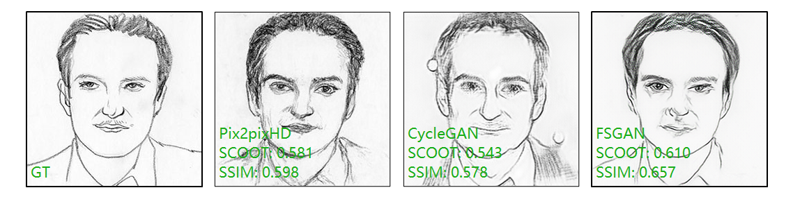

# FS2KToolbox

### FS2K Dataset

> Towards the translation between Face <--> Sketch.
>
> **Download** (photo+sketch+annotation): [Google-drive](https://drive.google.com/file/d/1saIMhQ3dc5_ftkfGmBPbCluRn_zy7QQp/view?usp=sharing), [Baidu-disk, pw: FS2K](https://pan.baidu.com/s/1eJVNPlGRbCc2zSp4iO8bVw).
>
> For more details about the FS2K dataset, please visit this [repo](https://github.com/DengPingFan/FS2K).

+ Put the source frames and result images as follows:

````
FS2K_PROJ_EVAL
├── photo
│       ├── photo1
│       ├── photo2
│       └── photo3
├── sketch
│       ├── sketch1
│       ├── sketch2
│       └── sketch3
├── I2S
│       ├── results_method1
│       ├── results_method2
│       └── ...
├── S2I
│       ├── results_method1
│       ├── results_method2
│       └── ...
├── anno_test.json
├── anno_train.json
````

 ### Evaluation

+ Metric: [SCOOT](https://dpfan.net/scoot/) (designed for sketch evaluation) and [SSIM](https://ece.uwaterloo.ca/~z70wang/publications/ssim.pdf).
+ Env: MATLAB (tested with MATLAB R2020b)
+ Run `eval_FSS_results.m` for testing.
+ Output: two excel files for saving SCOOT and SSIM scores of all methods: overall_scoot, scores_of_facial_parts.



### Reference

```@inproceedings{Fan_2019_ICCV,
@aticle{Fan2021FS2K,
  title={Deep Facial Synthesis: A New Challenge},
  author={Deng-Ping, Fan and Ziling, Huang and Peng, Zheng and Hong, Liu and Xuebin, Qin and Luc, Van Gool},
  journal={arXiv},
  year={2021}
}

@article{Fan2019ScootAP,
  title={Scoot: A Perceptual Metric for Facial Sketches},
  author={Deng-Ping Fan and Shengchuan Zhang and Yu-Huan Wu and Yun Liu and Ming-Ming Cheng and Bo Ren and Paul L. Rosin and Rongrong Ji},
  journal={2019 IEEE/CVF International Conference on Computer Vision (ICCV)},
  year={2019},
  pages={5611-5621}
}

@article{Wang2004ImageQA,
  title={Image quality assessment: from error visibility to structural similarity},
  author={Zhou Wang and Alan Conrad Bovik and Hamid R. Sheikh and Eero P. Simoncelli},
  journal={IEEE Transactions on Image Processing},
  year={2004},
  volume={13},
  pages={600-612}
}

```

